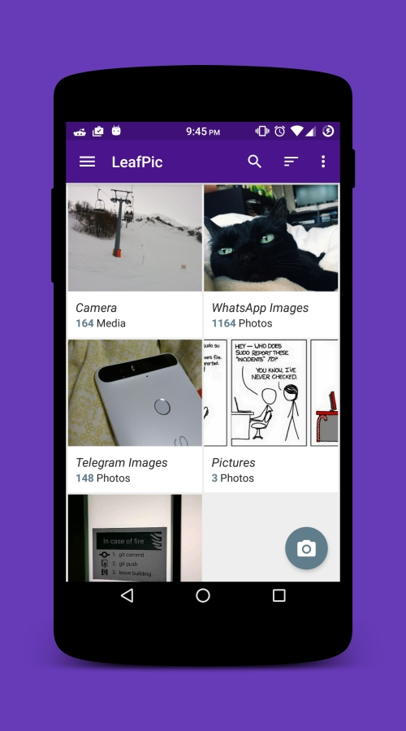
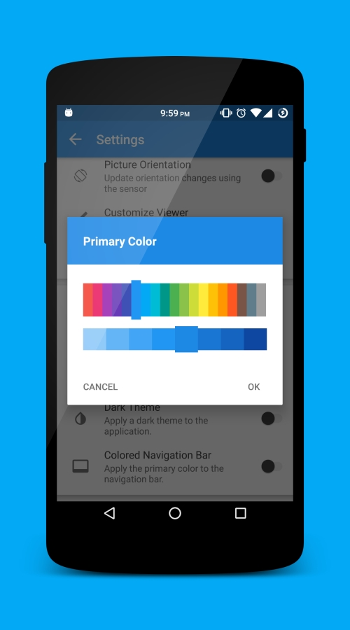
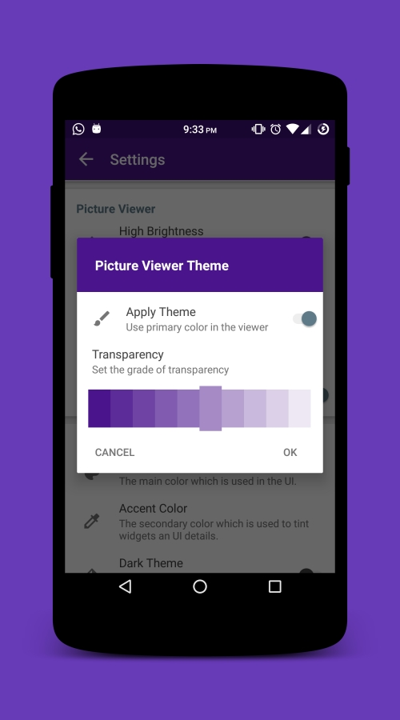
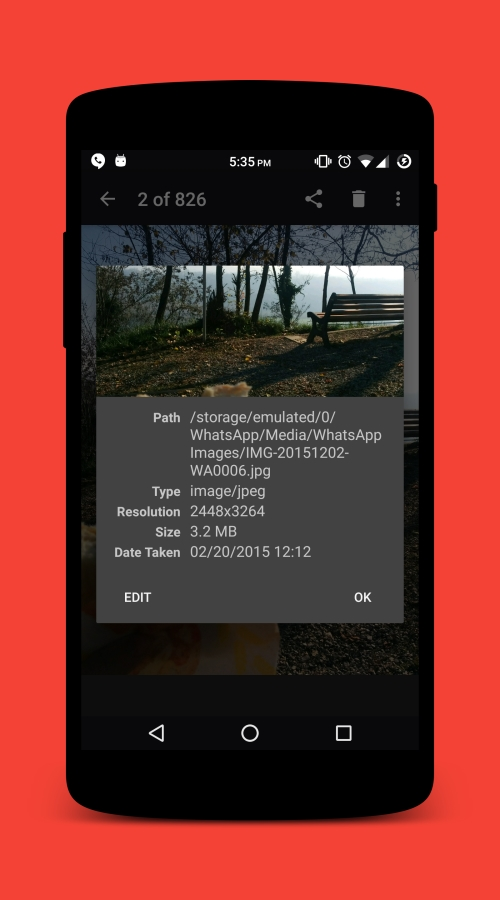

# LeafPic 
<!--     -->

LeafPic is a fluid, material-designed alternative gallery. LeafPic is ad-free, open sourced under GPL v3. It is smaller than other apps but it doesn't miss any of the main features.

LeafPic is available on F-Droid.

      
 
## Screenshot

#### Contributing

###### Code & Issues
If you are a developer and you wish to contribute to the app please fork the project
and submit a pull request.
If you have any questions, feel free to ask [me](mailto:dnld.sht@gmail.com) about whatever you want.
[Here](https://github.com/HoraApps/LeafPic/issues) is the list of known issues.
If you want to report new bugs please add helpful description or screenshots.

###### Translations
If you are able to contribute with a new translation of a missing language or if you want to improve an existing one, we greatly appreciate any suggestion!
[The project uses Crowdin](https://crowdin.com/project/leafpic), a platform that allows anybody to contribute to translating the app

#### Licensing
Leafpic is licensed under the [GNU v3 Public License](https://github.com/HoraApps/LeafPic/blob/master/LICENSE).

In addition to the terms set by the GNU v3 Public License, we ask that if you use any code from this repository that you send us a message to let us know.

